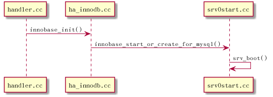

# innodb插件启动过程

## 类调用流程图

# 说明

## innobase\_init()

主要是初始化一些全局变量 ,为启动作准备

## innobase\_start\_or\_create\_for\_mysql()

主要完成 InnoDB启动过程

## srv\_boot()

包含有两个重要方法 :

-   srv\_general\_init(): 初始化同步控制系统,内存管理 系统,日志 。。。
-   srv\_init(): 初始化后台线程同步控制系统

## buf\_pool\_init()

    InnoDB的Buffer Pool初始化,它是根据系统配置参数innodb\_buffer\_pool\_size
(InnoDB Buffer Pool总大小)及innodb\_buffer\_pool\_instances(InnoDB Buffer Pool实例个数)来初始化的

## log\_init()

初始化日志系统,这是关于整个InnoDB存储引擎所有日志相关的初始化工作

## recv\_sys\_init()

初始化日志恢复系统.当数据库异常关闭，再次启动时，会用初始化后系统存储，解析日志内容并做恢复 

## io\_handler\_thread()

创建IO异步线程,共创建innodb\_write\_io\_threads+innodb\_read\_io\_threads个 是当上层对Buffer Pool发出读写请求时,主操作线程会将这个操作交给异步IO线程来做，读写操作不同之处是 读操作需要在请求之后等待之后异步读的完成 ,才能继续后面的操作(只有读到完整数据，才能继续后面的工作) 而写操作不需要等待及通知 ,InnoDB不会对单独页面 写操作就不需要等待及通知了,

只有在做检查 点或批量刷盘操作时，才会等待这个批量操作完成 .只有完成 了,确实写入文件中，才能将对应的日志废弃.

## open\_or\_create()

打开或创建系统数据文件(ibdata),如果文件存在,则打开，并且读取一些文件头信息,比如LSN,如果文件不存在,则会创建新文件 .
此时相当初始化一个新的数据库实例.这个函数执行完后，就可以知道当前是在初始化一个新数据实例还是在启动一个已存在的数据库

