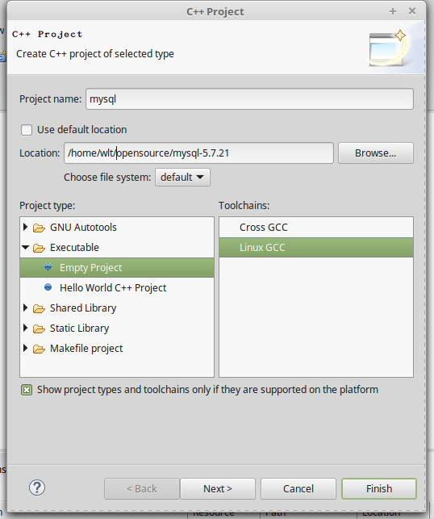
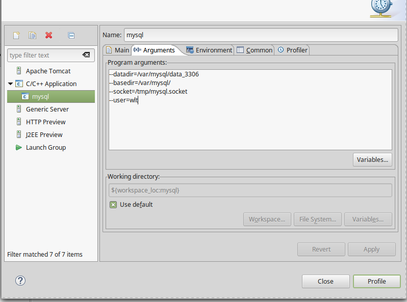

# mysql编译

## 准备

### 安装包网上下载:

-   mysql-5.7.21.tar.gz
-   boost\_1\_59\_0.tar.gz
    将上面两个包解压缩到指定目录,例如

/home/wlt/opensource/目录下

### 更新依赖

-   apt install cmake
-   apt install bison
-   apt install libaio-dev
-   apt install libncurses5-dev

## 编译安装mysql

### make 配置

    cd mysql-5.7.21
    mkdir debug
    cd debug

创建cmake.sh,内容如下:

    cmake .. -DBUILD_CONFIG=mysql_release \
    -DINSTALL_LAYOUT=STANDALONE \
    -DCMAKE_BUILD_TYPE=DEBUG \
    -DENABLE_DTRACE=OFF \
    -DWITH_EMBEDDED_SERVER=OFF \
    -DWITH_INNODB_MEMCACHED=ON \
    -DWITH_SSL=bundled \
    -DWITH_ZLIB=system \
    -DWITH_PAM=ON \
    -DCMAKE_INSTALL_PREFIX=/var/mysql/ \
    -DINSTALL_PUGINDIR="/var/mysql/lib/plugin" \
    -DDEFAULT_CHARSET=utf8 \
    -DDEFAULT_COLLATION=utf8_general_ci \
    -DWITH_EDITLINE=bundled \
    -DFEATURE_SET=community \
    -DCOMPILATION_COMMENT="mysql server(GPL)" \
    -DWITH_DEBUG=YES \
    -DWITH_BOOST=/home/wlt/opensource/boost_1_59_0

需要保证当前用户有/var/mysql目录写的权限

接下来生成Makefile配置

    sh cmake.sh

接下来编译 

    # 24表示使用24线程来编译
    make -j 24

### 安装

接下来安装 

    make install

创建配置文件 

    cd /var/mysql
    mkdir data_3306

初始化db

    cd /var/mysql/bin
    ./mysqld-debug --basedir=/var/mysql --datadir=/var/mysql/data_3306 --initialize --user=wlt

## 配置eclipse

### 新建项目

1.  新建一个c++项目

2.  如下图所示,将项目的地址选择为刚刚编译的mysql目录

     

### 配置debug

 如下图所示新建一个run configuration
 

-   C/C++ Application:

/home/wlt/opensource/mysql-5.7.21/debug/sql/mysqld-debug

-Program arguments

    --datadir=/var/mysql/data_3306
    --basedir=/var/mysql/
    --socket=/tmp/mysql.socket
    --user=wlt

### 权限处理

mysql5.7安全策略作了调整,第一次启动时，会在log\_error文件中生成 密码:

    2018-02-12T16:20:05.295589Z 0 [Warning] Gtid table is not ready to be used. Table 'mysql.gtid_executed' cannot be opened.
    2018-02-12T16:20:05.298436Z 1 [Note] A temporary password is generated for root@localhost: 7VLwehf?:j65

如上所示，密码为:  7VLwehf?:j65
我们登录 mysql时

    mysql -uroot -h127.0.0.1 -p
    #输完密码后可以这样修改密码
    alter user 'root'@'localhost' identified by 'new password';

