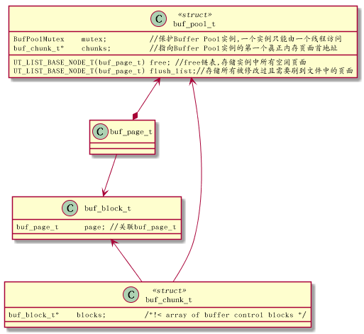
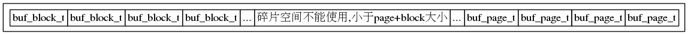

<h2>Table of Contents</h2>

<ul>
<li><a href="#orgeb1bb4f">1. Buffer Pool</a></li>
</ul>

# Buffer Pool

主要是用来存储访问过的数据页面,是一块连续内存.它是数据库中拥有最大块内在的系统模块.

InnoDB存储引擎中的数据访问是按页(默认16KB)的方式从数据库文件读取到Buffer Pool中的.数据库预先分配很多空间,用来与文件数据进行交换.按LRU算法实现Buffer Pool页面管理.

Buffer Pool大小可在配置文件中配置,由参数innodbbufferpoolsize的大小来决定，默认是128MB.可通过调整innodbbufferpoolinstances设置pool的实例数.

对于InnoDB任何修改都会首先在buf pool的page上进行,然后 这样的页面将被标记为dirty并被放到专门的flushlist上,后续由master thread或专门刷脏线程的阶段性将这些页面写入磁盘(落盘细节后面会再讲)

