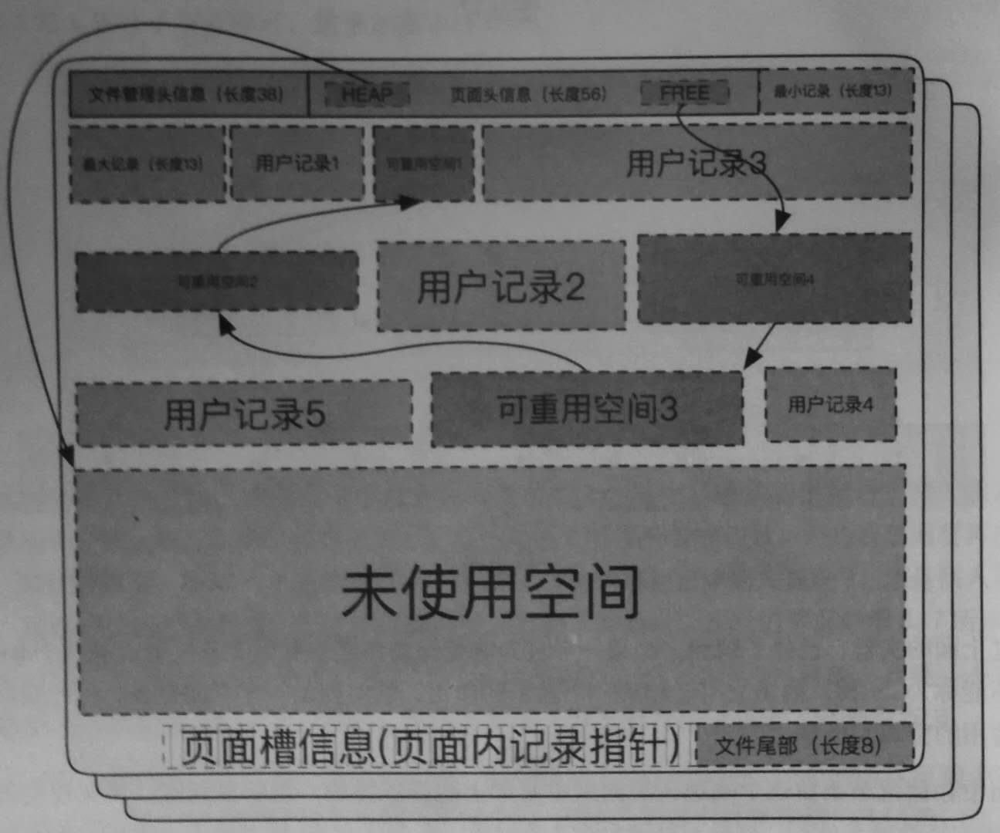
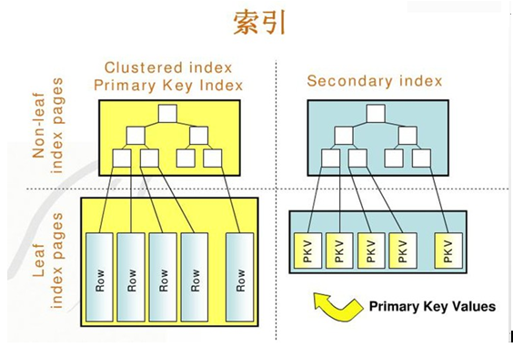
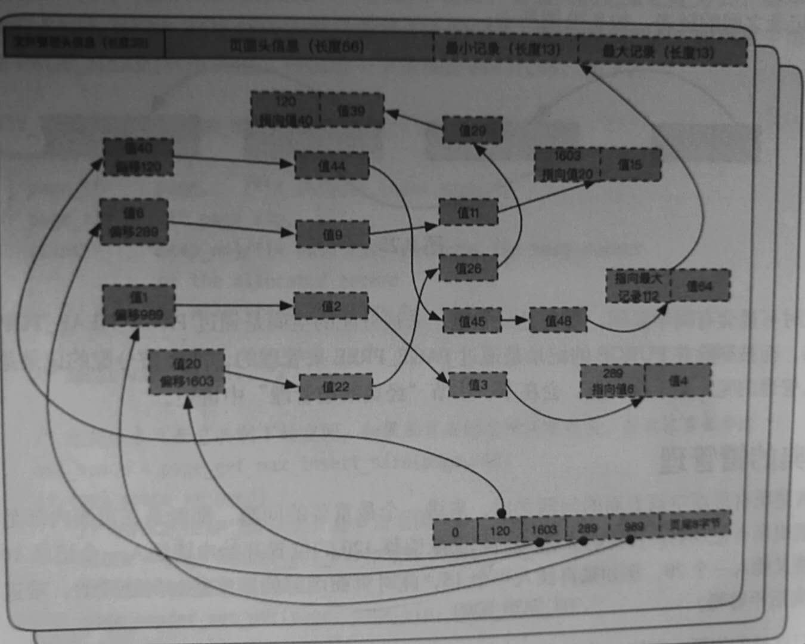
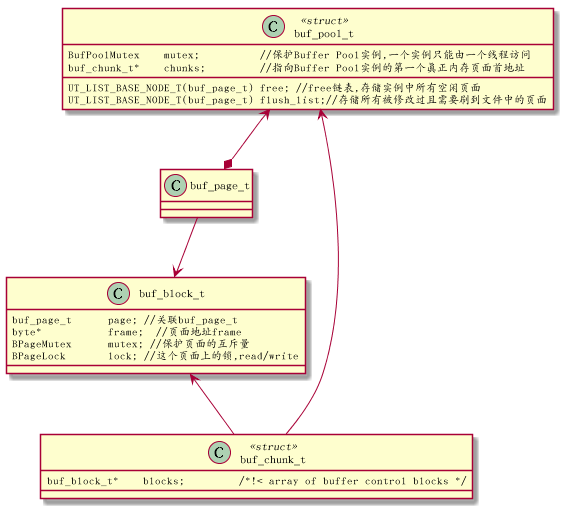

<h2>Table of Contents</h2>

<ul>
<li><a href="#orgc833f59">1. innodb文件结构</a>
<ul>
<li><a href="#org256c67e">1.1. 准备</a>
<ul>
<li><a href="#org0b57792">1.1.1. 数据库及表准备</a></li>
</ul>
</li>
<li><a href="#org7c2edc9">1.2. Inno数据存储结构说明</a>
<ul>
<li><a href="#orgc2a76d7">1.2.1. 表空间文件组成</a></li>
<li><a href="#orgddc687f">1.2.2. 段</a></li>
<li><a href="#orgd25ee82">1.2.3. 簇</a></li>
<li><a href="#orgd015cba">1.2.4. 页面</a></li>
</ul>
</li>
</ul>
</li>
<li><a href="#orgda80a57">2. 索引</a>
<ul>
<li><a href="#org746e8aa">2.1. 二级索引</a>
<ul>
<li><a href="#org714cd19">2.1.1. 自定义主键的聚簇索引</a></li>
<li><a href="#org5ccfeab">2.1.2. 未定义主键聚簇索引</a></li>
<li><a href="#orgdccf24c">2.1.3. 自定义主键的二级唯一索引</a></li>
<li><a href="#org4fb7563">2.1.4. 自定义主键的二级非唯一索引</a></li>
<li><a href="#org0004de3">2.1.5. 未定义主键的二级唯一索引</a></li>
<li><a href="#org7b369f6">2.1.6. 未定义主键的二级非唯一索引</a></li>
</ul>
</li>
<li><a href="#org83b4303">2.2. 查询B+ Tree索引的流程</a></li>
</ul>
</li>
<li><a href="#org0147cff">3. Buffer Pool</a></li>
<li><a href="#org4ea60f1">4. redo log</a>
<ul>
<li><a href="#org19e3969">4.1. 提交事务时,redo日志落盘时机</a></li>
</ul>
</li>
</ul>

# innodb文件结构

## 准备

### 数据库及表准备

    create database sample1;
    use sample1;
    create table sample1( id int not null auto_increment primary key, name varchar(8) );
    insert into sample1(name) values('aa');

## Inno数据存储结构说明

### 表空间文件组成

在/var/lib/mysql目录下执行: tree -a sample1  可以看到如下结果:

    sample1/
    ├── db.opt
    ├── sample1.frm
    └── sample1.ibd

可以看到在准备环节创建的sample1表的对应的文件 : sample1.ibd

(.frm文件对于InnoDB来说只是一个为了与mysql兼容的附属品而已,Mysql是一个插件式的数据库管理系统,它的结构分两层,分别是server层和存储层,server层只有一个,而存储层可以有多个存储引擎)

InnoDB存储引擎的逻辑存储结构和Oracle大致相同,所有数据都被逻辑地存放在表空间中(tablespace),表空间又由段(segment)，簇(extend),页(page)组成,一些文档又称为块(block). 一个表空间可以有多个文件,每个文件都各自编号.创建一个表空间时，至少有一个文件,称为0号文件,这个文件的第一个页面(page\_no为0)存储了这个表空间中所有段簇页管理入口,表空间,段，簇，页的关系如下图所示:

### 段

段是表空间中的主要组织结构,它是逻辑概念，用来管理物理文件,是构成索引,表,回滚段的基本元素.创建一个索引(B+树)时会同时创建两个段,分别是内节点段和叶子段,内节点段用来管理(存储)B+树中非叶子节点(页面)的数据,叶子段用来管理(存储)B+树中叶子节点数据.

### 簇

段由若干簇构成,创建一个段会创建一个默认簇.一个簇存不下来会从段分配多一个新的簇.

### 页面

页是簇组成单位,也是数据库管理的最小单位,也是能分配的最小单位.

# 索引

聚簇索引并不是一种单独的索引类型,而是一种数据存储方式.InnoDB聚簇索引实际上是在同一结构中保存了b+Tree索引和数据行
当有聚簇索引时,它的数据行实际上存放的叶子节点.聚簇表示数据行和相邻的健值紧凑地存储在一起.
InnoDB的二级索引(Secondary Index)节点存储索引值,叶子节点保存的是"回表"的信息,所谓回表,就是使用二级索引的指针的值，来找到聚簇索引的全部数据.然后根据完整数据索引取出所需要的列的过程.

## 二级索引

聚簇索引与二级索引之间的逻辑关系如下:

### 自定义主键的聚簇索引

索引结构: [主键][TRXID][ROLLPTR][其他建表创建的非主键列]

参与记录比较的列: 主键列

内节点Key列: [主键列]+PageNo指针

### 未定义主键聚簇索引

索引结构:[ROWID][TRXID][ROLLPTR][其他建表创建的非主键列]

参与记录比较列: 只ROWID一列而已

内节点Key列: [ROWID]+PageNo指针

### 自定义主键的二级唯一索引

索引结构:[唯一索引列][主键列]

参与记录比较列:[唯一索引列][主键列]

内节点Key列:[唯一索引列]+PageNo指针

### 自定义主键的二级非唯一索引

索引结构:[非唯一索引列][主键列]

参与记录比较的列:[非唯一索引列][主键列]

内节点Key列:[非唯一索引列][主键列]+PageNo指针

### 未定义主键的二级唯一索引

索引结构:[唯一索引列][ROWID]

参与记录比较的列:[唯一索引][ROWID]

内节点Key列: [唯一索引列]+PageNo指针

### 未定义主键的二级非唯一索引

索引结构:[非唯一索引列][ROWID]

参与记录比较的列:[非唯一索引列][ROWID]

内节点Key列:[非唯一索引][ROWID]+PageNo指针

## 查询B+ Tree索引的流程

B+树索引定位到数据所在的页面后,将数据页加载到内存中,通过查找槽定位数据.多条记录对应一个槽(slot),槽占用两个字节,槽的增长是从高字节到低字节的顺序存储的.最高位槽代表的是页面内索引顺序最小的记录.

mysql通过二分法查找定位到具体的数据

# Buffer Pool

主要是用来存储访问过的数据页面,是一块连续内存.它是数据库中拥有最大块内在的系统模块.

InnoDB存储引擎中的数据访问是按页(默认16KB)的方式从数据库文件读取到Buffer Pool中的.数据库预先分配很多空间,用来与文件数据进行交换.按LRU算法实现Buffer Pool页面管理.

Buffer Pool大小可在配置文件中配置,由参数innodb\_buffer\_pool\_size的大小来决定，默认是128MB.可通过调整innodb\_buffer\_pool\_instances设置pool的实例数.

对于InnoDB任何修改都会首先在buf pool的page上进行,然后 这样的页面将被标记为dirty并被放到专门的flush\_list上,后续由master thread或专门刷脏线程的阶段性将这些页面写入磁盘(落盘细节后面会再讲)

# redo log

前面讲到master thread或专门刷脏线程会将dirty页面写入磁盘.这里首先是顺序写入到redo log,这样的好处是避免每次操作磁盘导致大量的随机IO.

InoDB通过日志组来管理日志文件,它包含若干个日志文件,REDO日志写入都是字节连续的,其内部也是按照大小相等页面切割,大小是512字节,即扇区大小(历史原因).

## 提交事务时,redo日志落盘时机

  因为innodb\_flush\_log\_at\_trx\_commit值的不同,会产生不同的行为. 

