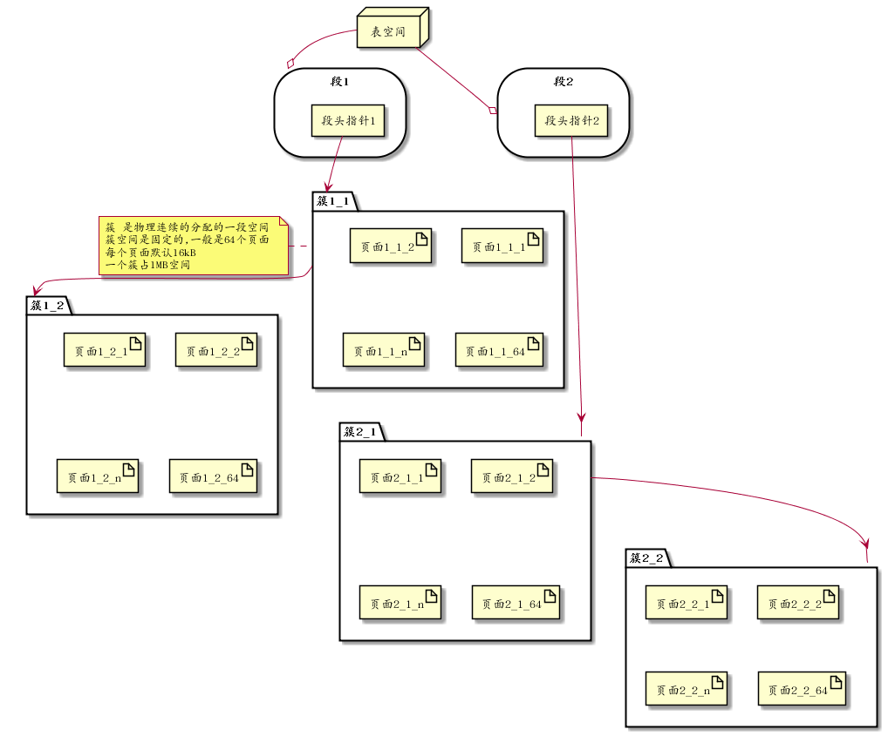

<h2>Table of Contents</h2>

<ul>
<li><a href="#orgfb5bdab">1. 准备</a>
<ul>
<li><a href="#org0543718">1.1. 数据库及表准备</a></li>
</ul>
</li>
<li><a href="#orgbfe3719">2. Inno数据存储结构说明</a>
<ul>
<li><a href="#orgd06c57c">2.1. 表空间文件组成</a></li>
<li><a href="#org95fd040">2.2. 段</a></li>
<li><a href="#org6fb45ca">2.3. 簇</a></li>
<li><a href="#org0d1e427">2.4. 页面</a></li>
</ul>
</li>
</ul>

# 准备

## 数据库及表准备

    create database sample1;
    use sample1;
    create table sample1( id int not null auto_increment primary key, name varchar(8) );
    insert into sample1(name) values('aa');

# Inno数据存储结构说明

## 表空间文件组成

在/var/lib/mysql目录下执行: tree -a sample1  可以看到如下结果:

    sample1/
    ├── db.opt
    ├── sample1.frm
    └── sample1.ibd

可以看到在准备环节创建的sample1表的对应的文件 : sample1.ibd

(.frm文件对于InnoDB来说只是一个为了与mysql兼容的附属品而已,Mysql是一个插件式的数据库管理系统,它的结构分两层,分别是server层和存储层,server层只有一个,而存储层可以有多个存储引擎)

InnoDB存储引擎的逻辑存储结构和Oracle大致相同,所有数据都被逻辑地存放在表空间中(tablespace),表空间又由段(segment)，簇(extend),页(page)组成,一些文档又称为块(block). 一个表空间可以有多个文件,每个文件都各自编号.创建一个表空间时，至少有一个文件,称为0号文件,这个文件的第一个页面(pageno为0)存储了这个表空间中所有段簇页管理入口,表空间,段，簇，页的关系如下图所示:

## 段

段是表空间中的主要组织结构,它是逻辑概念，用来管理物理文件,是构成索引,表,回滚段的基本元素.创建一个索引(B+树)时会同时创建两个段,分别是内节点段和叶子段,内节点段用来管理(存储)B+树中非叶子节点(页面)的数据,叶子段用来管理(存储)B+树中叶子节点数据.

## 簇

段由若干簇构成,创建一个段会创建一个默认簇.一个簇存不下来会从段分配多一个新的簇.

## 页面

页是簇组成单位,也是数据库管理的最小单位,也是能分配的最小单位.

