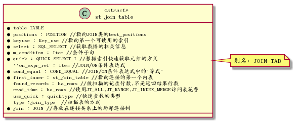
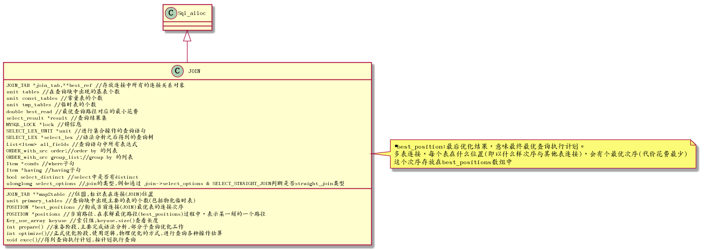
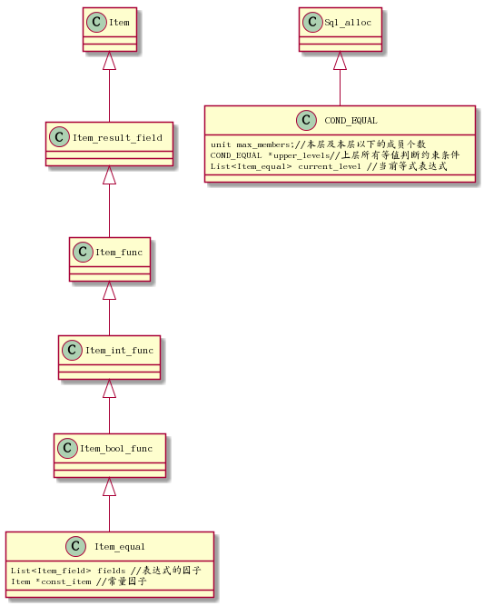

<h2>Table of Contents</h2>

<ul>
<li><a href="#org8cb3657">1. 主要的类和数据结构</a>
<ul>
<li><a href="#org3897971">1.1. 查询树</a>
<ul>
<li><a href="#org54f64c5">1.1.1. stselectlex</a></li>
<li><a href="#orgff9d5b6">1.1.2. TABLELIST</a></li>
</ul>
</li>
<li><a href="#orgf322114">1.2. 索引类</a></li>
<li><a href="#orgab8a41c">1.3. 连接表</a></li>
<li><a href="#org3f55a4d">1.4. 连接类(JOIN)</a></li>
<li><a href="#orgd9a609f">1.5. 约束条件</a></li>
<li><a href="#org780f73b">1.6. 位置</a></li>
<li><a href="#org3615cd2">1.7. 代价估算</a></li>
</ul>
</li>
</ul>

# 主要的类和数据结构

## 查询树

### stselectlex

语法分析器的结果是查询树,使用stselectlex类表示 
stselectlex定义位于sqllex.h文件,主要表示语法分析器的结果：查询树

### TABLELIST

查询关系表,位于table.h,关系表存放很多信息,有查询优化阶段需要的

## 索引类

## 连接表

连接表介于关系(TABLELIST类),与连接类(JOIN类)之间一个过渡对象,存放关系一些相关信息,也存放了连接操作操作的一些信息,所以称为连接表

## 连接类(JOIN)

JOIN类主要操作对应查询语句连接关系内容,是优化和执行的基本单位,也是优化结果(查询执行计划)的储存对象,本类在文件: sqloptimizer.h中

## 约束条件

约束条件是指Where或join/on或having子句谓词表达式,分两种,一种是限制条件,用来过滤元组;另一种是连接条件,满足连接条件的元组才会连接,连接条件表达式一般包括两个或两个以上的关系的常量 ,该类在:item.h中

Mysql用Item类表示约束条件表达式,这是一个父类,由一系列子类继承这个父类,Itemequal类与Item类之间的关系如下图所示:

## 位置

在连接顺序中,位置是指被连接的表的位置(一个表在多表连接构成的连接顺序中处于的位置),这个位置储存了被访问的表,被使用的访问方法,关连接策略的选择,半连接优化状态.Mysql的多表连接算法支付的是从左到右的类似左深树连接方式,但左深树是一个树型结构,而mysql多表连接算法连接表是一个平台结构,先对表进行排序，然后从左到右地连接排好序的表,然后确定当前连接方式的花费

## 代价估算

Mysql提供代价估算类包括4个层面: IO花费,CPU花费,远程操作花费,内在操作花费,v5.6不考虑内存，远程花费

