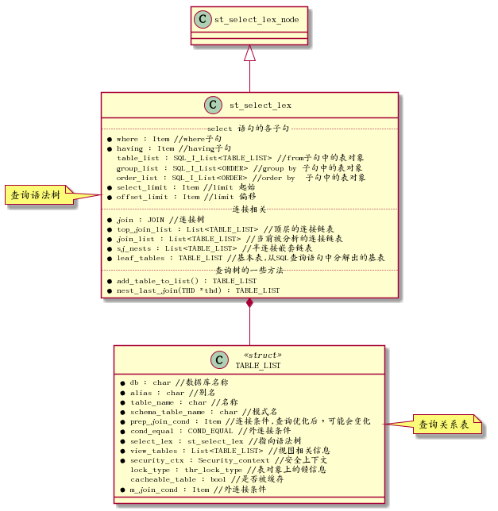
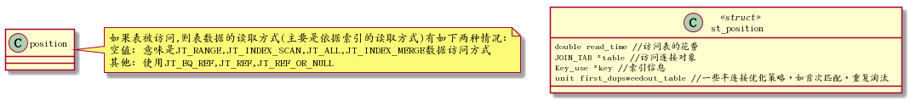

# Mysql查询执行过程

## 查询执行过程

### 语法分析阶段

将sql查询语句变换成为一查查询树st\_select\_lex传给优化器,并对sql表达语义进行检查

### 生成逻辑查询执行计划阶段

遍历查询树,确定关系是否是常量表,为每个关系查找可用索引,运用关系代数原理和启发式规则优化

### 生成物理查询执行计划阶段

对每个关系尽量利用索引计算其代价,找出代价最小的路径后保存到JOIN类的best\_positions

### 执行查询执行计划阶段

## 查询过程类

### sql\_parse.cc

词法分析，语法分析,语义检查

### sql\_resolver.cc

JION.prepare预处理

### sql\_optimizer.cc

JOIN.optimize查询优化
还会作代价估算器，统计信息

1.  sql\_optimizer.cc

    逻辑优化

2.  sql\_planner.cc

    greedy\_search 物理优化

### sql\_executor.cc

JOIN.exec执行器

### 执行结果

# 表数据的访问方式

## 常量表

-   system表: 表中只有一行数据
-   const表: 经where语句中限制条件(column=常数)筛选后只有一行数据，这表明column列上有索引，而且索引可能是主键列或唯一列,结果是0行或1行

代码表示方式可参考:sql\_opt\_exec\_shared.h的 enum join\_type

<table border="2" cellspacing="0" cellpadding="6" rules="groups" frame="hsides">

<colgroup>
<col  class="org-left" />

<col  class="org-left" />

<col  class="org-left" />
</colgroup>
<thead>
<tr>
<th scope="col" class="org-left">类型</th>
<th scope="col" class="org-left">代码表示方式</th>
<th scope="col" class="org-left">说明</th>
</tr>
</thead>

<tbody>
<tr>
<td class="org-left">system</td>
<td class="org-left">JT\_SYSTEM</td>
<td class="org-left">常量表情况一,表上只有一条元组匹配</td>
</tr>

<tr>
<td class="org-left">const</td>
<td class="org-left">JT\_CONST</td>
<td class="org-left">常量表情况二,最多有一条元组匹配</td>
</tr>

<tr>
<td class="org-left">eq\_ref</td>
<td class="org-left">JT\_EQ\_REF</td>
<td class="org-left">参与连接运算的表,且是内表.基于索引(连接字段上存在唯一索引或主键索引，且操作符是"="的谓词,连接字段不能为NULL)做扫描, 使得对外表的一条元组内表只有一条元组与之对应</td>
</tr>

<tr>
<td class="org-left">ref</td>
<td class="org-left">JT\_REF</td>
<td class="org-left">可用于单表扫描或连接 ,参与连接运算的表是内表.基于索引(连接字段索引是非唯一索引,操作符是"="，)，使用外表一条元组,内表可有若干元组对应</td>
</tr>

<tr>
<td class="org-left">ref\_or\_null</td>
<td class="org-left">JT\_REF\_OR\_NULL</td>
<td class="org-left">类似ref,只是搜索条件条件包括: 连接字段值可为NULL的情况,如where col=xx or col is null</td>
</tr>

<tr>
<td class="org-left">range</td>
<td class="org-left">JT\_RANGE</td>
<td class="org-left">范围扫描,基于索引做范围，为诸如between ,in ,>=,like类操作提供支持</td>
</tr>

<tr>
<td class="org-left">index</td>
<td class="org-left">JT\_INDEX\_SCAN</td>
<td class="org-left">索引做扫描,基于索引在索引的叶子结点上找满足条件的数据(不需要访问数据文件)</td>
</tr>

<tr>
<td class="org-left">ALL</td>
<td class="org-left">JT\_ALL</td>
<td class="org-left">全表扫描或范围扫描,不使用索引,顺序扫描</td>
</tr>

<tr>
<td class="org-left">unique\_subquery</td>
<td class="org-left">JT\_UNIQUE\_SUBQUERY</td>
<td class="org-left">在子查询中，基于唯一索引进行扫描,类似 eq\_ref</td>
</tr>

<tr>
<td class="org-left">index\_subquery</td>
<td class="org-left">JT\_INDEX\_SUBQUERY</td>
<td class="org-left">在子查询中，基于除唯一索引之外索引进行扫描</td>
</tr>

<tr>
<td class="org-left">index\_merge</td>
<td class="org-left">JT\_INDEX\_MERGE</td>
<td class="org-left">在2个及2个以上索引存在且可用时，查询可以使用多个索引进行查找,然后 通过交集或并集合查询结果</td>
</tr>

<tr>
<td class="org-left">&#xa0;</td>
<td class="org-left">JT\_FT</td>
<td class="org-left">FT,FullText全文检索</td>
</tr>
</tbody>
</table>

# 主要的类和数据结构

## 查询树

### st\_select\_lex

语法分析器的结果是查询树,使用st\_select\_lex类表示 
st\_select\_lex定义位于sql\_lex.h文件,主要表示语法分析器的结果：查询树

### TABLE\_LIST

查询关系表,位于table.h,关系表存放很多信息,有查询优化阶段需要的

## 索引类

## 连接表

连接表介于关系(TABLE\_LIST类),与连接类(JOIN类)之间一个过渡对象,存放关系一些相关信息,也存放了连接操作操作的一些信息,所以称为连接表

## 连接类(JOIN)

JOIN类主要操作对应查询语句连接关系内容,是优化和执行的基本单位,也是优化结果(查询执行计划)的储存对象,本类在文件: sql\_optimizer.h中

## 约束条件

约束条件是指Where或join/on或having子句谓词表达式,分两种,一种是限制条件,用来过滤元组;另一种是连接条件,满足连接条件的元组才会连接,连接条件表达式一般包括两个或两个以上的关系的常量 ,该类在:item.h中

Mysql用Item类表示约束条件表达式,这是一个父类,由一系列子类继承这个父类,Item\_equal类与Item类之间的关系如下图所示:

## 位置

在连接顺序中,位置是指被连接的表的位置(一个表在多表连接构成的连接顺序中处于的位置),这个位置储存了被访问的表,被使用的访问方法,关连接策略的选择,半连接优化状态.Mysql的多表连接算法支付的是从左到右的类似左深树连接方式,但左深树是一个树型结构,而mysql多表连接算法连接表是一个平台结构,先对表进行排序，然后从左到右地连接排好序的表,然后确定当前连接方式的花费

## 代价估算

Mysql提供代价估算类包括4个层面: IO花费,CPU花费,远程操作花费,内在操作花费,v5.6不考虑内存，远程花费

